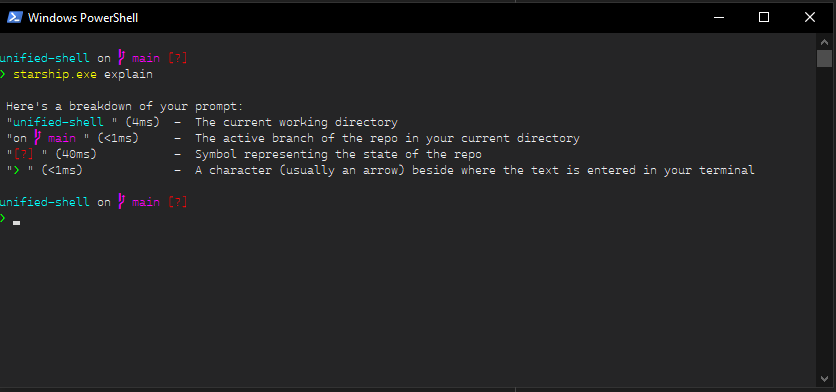

# Powershell

This document contains the documentation to configure a powershell as the following image:

1. Install [winget](https://github.com/microsoft/winget-cli):

    1. Access the repository.
    1. Go to releases.
    1. Download and install the latest `.msixbundle`.

1. Install a font that supports the Nerd Font Symbols, for example the [Cascadia Code|Mono NF](https://github.com/microsoft/cascadia-code) or DejaVuSans:

    1. Download the [Font Patcher](https://www.nerdfonts.com/).
    1. Extract it.
    1. Download a font and extract it [Dejavu](https://dejavu-fonts.github.io/)
    1. Go to releases.
    1. Download de font.
    1. Unpack it.
    1. Open a wsl shell in the font patcher folder and install the dependencies `apt install fontforge python3-fontforge`.
    1. Patch a font `python3 font-patcher  --complete ../dejavu-fonts-ttf-2.37/ttf/DejaVuSans.ttf`.
    1. Install the generated font by double clicking it.

1. Install [startship](https://starship.rs/):

    1. In the site should be all the documentation.
    1. To sum up, use winget with: `winget install starship`.

1. Set starship in powershell as startup script:

    1. Create a file `~/Documents/WindowsPowerShell/Microsoft.PowerShell_profile.ps1`.
    1. Add this line to the file `Invoke-Expression (&starship init powershell)`.

1. Open powershell and change the settings to show the font and color:

    1. Right click the tab header and go to the properties.
    1. In `Font` select the installed font, for example `Cascadia Mono NF Extralight`.
    1. In color write the dark mode vs code colors: `Red: 37, Green 37, Blue 38`.

1. Set the font in vscode.

    1. Open the configuration JSON (`F1` and `Open User Settings`).
    1. Set the font: `"terminal.integrated.fontFamily": "'Cascadia Mono NF Extralight'"`.
