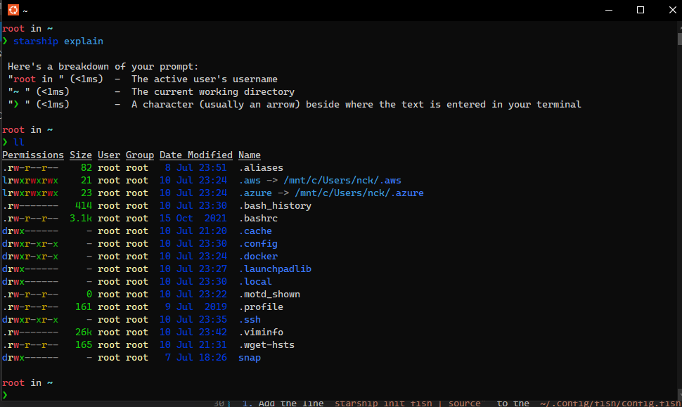

# WSL Ubuntu

This document contains the installation of fish together with starship in WSL.



## Prerequisites

1. Have the terminal with nerf font installed. See [powershell.md](powershell.md)

## Fish

Follow the instructions of [fish shell](https://fishshell.com/):

1. Add the repository for the current version, which you can check with `cat /etc/os-release`:

```bash
sudo apt-add-repository ppa:fish-shell/release-3
sudo apt update
sudo apt install fish
```

1. Set it as default shell with `chsh -s $(which fish)`

## Starship

This will make the styling for us.

1. Use the curl of [the project](https://starship.rs/).
1. Add the line `starship init fish | source"` to the `~/.config/fish/config.fish`.

## Better ls

1. Install exa with `apt-get install exa`

## Aliases

1. Add some aliases:

```bash
alias ..='cd ..'
alias ...='cd ../..'
alias ls='exa -lag --header'
```
